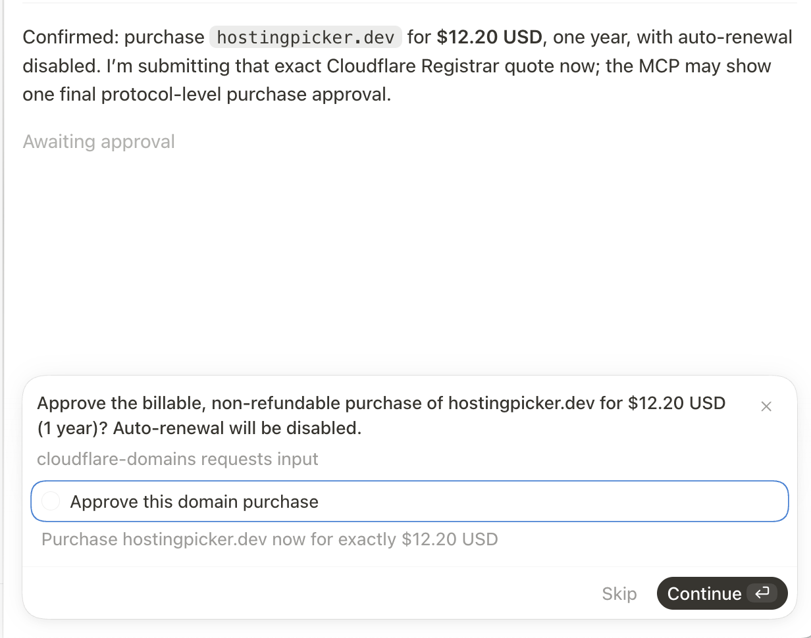

# Cloudflare Domains Toolkit

This is one of the software packages I publish with full source code. The landing page is <https://flaviocopes.com/software/cloudflare-domains/>.

It is MIT licensed. You are free to use it, fork it and change it, also for commercial work.

There is no support. Issues, pull requests, discussions, and the wiki are turned off, and there is no roadmap. Forks are welcome.

If you point a coding agent at this repository, have it read `AGENTS.md` first.

> **Warning.** Domain purchases made through the MCP server are real. Cloudflare
> charges your payment method and a registration is non-refundable. The
> Cloudflare Registrar API is in beta, so supported extensions and API behavior
> can change. Read the [Security](#security) section before you enable
> `purchase_domain`.

## Table of contents

- [What this is](#what-this-is)
- [What you get](#what-you-get)
- [Start here](#start-here)
- [Quick verification](#quick-verification)
- [Requirements](#requirements)
- [Project structure](#project-structure)
- [Why I built this](#why-i-built-this)
- [Architecture](#architecture)
- [How it was built](#how-it-was-built)
- [Configuration](#configuration)
- [Installation and distribution](#installation-and-distribution)
- [Customization ideas](#customization-ideas)
- [Security](#security)
- [Technical decisions](#technical-decisions)
- [Changelog](#changelog)
- [License](#license)

## What this is

Cloudflare Domains Toolkit contains two focused local tools:

1. **Cloudflare Domain MCP** lets an AI search, check, quote, and register a
   domain through Cloudflare Registrar. A person must approve the exact domain
   and live price before the billable call.
2. **Cloudflare Domains CLI** lists zones and manages DNS records after a domain
   is on Cloudflare.

Both tools are client-neutral, open source, and designed to keep Cloudflare API
tokens outside the project folder.

Current release: **1.0.1** (`1.0.1` in both package manifests).

## What you get

- a standard local stdio MCP server
- domain search and authoritative availability checks
- exact registration quotes that expire after five minutes
- standard MCP human approval during a purchase
- a hard $20 maximum for the complete initial domain charge
- a second availability, price, and term check before approval
- a companion `cf-domains` DNS command-line tool
- confirmation before interactive DNS deletion
- macOS login Keychain support
- environment-variable support for other systems
- Cursor, Codex, and generic MCP client examples
- automated unit tests and an MCP smoke test
- beginner setup guides and technical architecture notes
- the complete [creation story](#how-it-was-built) and a
  [real MCP purchase-approval screenshot](screenshots/purchase-approval.png)

## Start here

Read these sections in order:

1. [Why I built this](#why-i-built-this) explains why this repository contains both MCP and CLI tools.
2. [How it was built](#how-it-was-built) tells the complete story of how I created and verified it.
3. [Configuration](#configuration) explains the two least-privilege Cloudflare tokens.
4. [Architecture](#architecture) shows how each request moves through the code.
5. [Security](#security) explains the financial and DNS safety boundaries.

Each tool also has a focused guide:

- [`mcp/README.md`](mcp/README.md)
- [`cli/README.md`](cli/README.md)

## Quick verification

Verify the MCP server:

```bash
cd mcp
npm install
npm run check
npm test
npm run smoke
```

Verify the DNS CLI:

```bash
cd ../cli
npm install
npm run check
npm test
```

The automated tests use fakes and placeholder credentials. They do not buy a
domain or change DNS.

## Requirements

- Node.js 20 or newer
- a Cloudflare account
- a Registrar-capable Cloudflare account for domain purchases
- two narrowly scoped API tokens: one for Registrar and one for DNS
- a default payment method and registrant contact for Registrar
- an MCP client with stdio support
- MCP form elicitation support for AI-assisted purchases
- macOS for Keychain storage, or another local secret provider

Cloudflare currently describes the Registrar API as beta. Supported extensions
and API behavior can change.

## Project structure

```text
├── mcp/                  Domain discovery and guarded registration server
├── cli/                  Zone and DNS record command-line tool
├── screenshots/          Real MCP purchase-approval example
├── AGENTS.md             Rules for AI coding agents
├── README.md             This file: setup, story, architecture, security, decisions, changelog
└── LICENSE               MIT
```

## Why I built this

A domain has two distinct phases.

First you discover and register it. That flow can charge a payment method and
create a non-refundable registration. It needs a firm human approval boundary.

Then you connect the domain to websites, email, and other services. That work
is mostly DNS: inspecting records, adding a value, correcting an address, or
removing something obsolete.

This toolkit keeps those phases separate while making both available locally.

### Why registration is an MCP server

An AI client often runs tools without an interactive terminal. MCP gives the
server a standard way to pause a tool call and ask the client to show a human
confirmation form.

The server checks Cloudflare's live data, creates a short-lived quote, enforces
the $20 initial-charge limit, checks everything again, and only then asks for
approval. The AI can prepare the purchase. The person makes the final decision.

A prompt or skill can recommend those steps, but it cannot enforce them.

### Why DNS is a CLI

DNS management does not need the same purchase workflow. A small CLI is easy to
use directly, easy for many AI tools to call, and clear about the exact command
being run.

The destructive DNS operation still asks for confirmation by default. For
automation, `--yes` exists, but should be used only after the record ID and
domain have been reviewed.

### Why two Cloudflare tokens

Registrar and DNS permissions have different consequences. One can buy a
domain. The other can reroute traffic and email.

Separate, narrowly scoped tokens follow least privilege. A program gets only
the capability it needs, and a credential incident has a smaller effect.

### What this project is not

This is not a complete Cloudflare administration suite. It does not manage
Workers, billing, transfers, renewals, account members, or every DNS feature.

It focuses on one useful journey: find a domain safely, register it with human
approval, and manage its ordinary DNS records from a readable CLI.

## Architecture

This repository contains two local programs with independent package manifests,
dependencies, token storage entries, and Cloudflare permissions.

```text
AI client                         person or AI tool
    |                                   |
    | MCP tools + approval              | cf-domains commands
    v                                   v
mcp/src/server.ts                 cli/src/cli.js
    |                                   |
    v                                   v
mcp/src/service.ts                cli/src/cloudflare.js
    |                                   |
    v                                   v
Cloudflare Registrar API          Cloudflare Zones + DNS API
```

Neither program opens a local network port. The MCP server communicates over
stdio. The CLI runs one command and exits.

### Registrar MCP layer

`mcp/src/server.ts` creates the MCP server and registers four typed tools:

- `search_domains`
- `check_domain_availability`
- `quote_domain_purchase`
- `purchase_domain`

Zod validates tool arguments. MCP annotations mark discovery tools as read-only
and registration as destructive. The same layer sends the standard MCP
elicitation request containing the exact domain, price, term, and warning.

### Registrar service layer

`mcp/src/service.ts` owns the purchase policy. It normalizes domains,
creates and stores quotes, enforces exact matching, recalculates live pricing,
requests approval, and finally calls the registration adapter.

Because this layer does not know about JSON-RPC or HTTP, tests can use a fake
Registrar client and a fake approval callback.

### Registrar API adapter

`mcp/src/cloudflare.ts` owns Cloudflare HTTPS requests: search,
authoritative availability checks, extension metadata, and registration.

`config.ts` reads the account ID and Registrar token. `domain.ts` validates
ASCII domain names. `money.ts` converts decimal USD strings to integer cents so
the purchase boundary never relies on floating-point arithmetic.

### Availability flow

```text
user asks whether a domain is available
  -> client calls check_domain_availability
  -> server validates the exact domain
  -> Cloudflare checks registry availability and pricing
  -> server returns a read-only result
```

No quote or mutable state is created.

### Purchase flow

```text
quote_domain_purchase
  -> authoritative check
  -> reject premium or non-USD result
  -> read the minimum registration term
  -> calculate the complete initial charge
  -> enforce the $20 limit
  -> store a five-minute quote in memory

purchase_domain
  -> match quote ID, domain, currency, and cents exactly
  -> check availability, price, and term again
  -> reject any change and require a new quote
  -> request human approval through MCP
  -> mark the quote used
  -> call Cloudflare's registration endpoint
```

Quotes live in an in-memory `Map`. Restarting the MCP process invalidates them.
The quote is marked used before registration to prevent an automatic retry
when a network failure leaves Cloudflare's final state unclear.

### DNS CLI command layer

`cli/src/cli.js` defines commands with Commander and interactive prompts
with Prompts. It parses flags, prints tables, and requires confirmation before
deletion unless `--yes` is explicitly passed.

### DNS API adapter

`cli/src/cloudflare.js` finds the exact zone, handles pagination,
normalizes record names, builds allow-listed request bodies, and reports
Cloudflare API errors.

The client accepts an injected `fetch` implementation, which lets tests inspect
requests without network access.

`cli/src/keychain.js` reads the DNS token from the process environment or
the macOS login Keychain.

### DNS change flow

```text
cf-domains update example.com record-id --content new-value
  -> read the DNS token
  -> find the exact Cloudflare zone
  -> build a PATCH body from explicitly provided fields
  -> send the request to Cloudflare
  -> print the resulting record
```

Create and update requests allow-list supported fields. Unexpected CLI values
are not copied into the Cloudflare request body.

## How it was built

This is the complete story of the build.

The interesting part is not the four MCP tools. The interesting part is the
boundary around the final tool. It can spend real money, so a good prompt is
not enough protection.

I wanted the safety rules to live in code.

### The starting point

The idea started with a practical question: could I ask an AI to find a good
domain and buy it through Cloudflare?

Checking names is harmless. Buying one is billable and non-refundable. That
changes the shape of the project.

I wrote the central rule before writing the server:

> The AI can search and prepare. A person approves the exact live purchase.

I also set a hard $20 limit. The limit applies to the complete initial charge,
not just the price shown for one year.

Those two rules guided every later decision.

### I split the job into two tools

Domain registration and DNS management look related. They have different risk
profiles.

The Registrar MCP server can:

- search for domain ideas
- check one exact domain
- create a short-lived quote
- purchase one quoted domain after approval

The companion CLI can:

- list Cloudflare zones
- list DNS records
- create and update records
- delete one record after confirmation

This split keeps the billable surface small. The Registrar token never needs
DNS access. The DNS token never needs permission to buy domains.

It also makes the MCP server easier to understand. Four tools are enough.

### I started with the external API boundary

The first implementation file was the Cloudflare adapter.

`mcp/src/cloudflare.ts` owns every Registrar HTTP request. It knows the
account URL, request bodies, authentication header, and Cloudflare response
envelope.

The rest of the program does not know those details.

The adapter exposes four operations:

```ts
interface RegistrarClient {
  checkDomain(domain: string): Promise<DomainAvailability>
  searchDomains(query: string, limit: number): Promise<DomainAvailability[]>
  getMinimumRegistrationYears(domain: string): Promise<number>
  createRegistration(domain: string, years: number): Promise<RegistrationWorkflow>
}
```

This interface made testing possible. Unit tests use a fake implementation and
never contact Cloudflare.

It also gave the application a clean seam. If the Registrar API changes, the
HTTP details stay in one file.

### I made exact domain input boring

A purchase tool should not guess what the user meant.

`mcp/src/domain.ts` normalizes a domain to lowercase, removes one trailing
dot, and validates the labels. It rejects URLs, paths, ports, wildcards,
Unicode input, empty labels, and invalid hyphen placement.

This means the purchase layer receives one plain ASCII domain such as:

```text
hostingpicker.dev
```

It never receives `https://hostingpicker.dev`, `*.hostingpicker.dev`, or a
sentence containing a domain.

Search is deliberately looser. Search helps with discovery. Quote and purchase
work with one exact registrable domain.

### I represented money as integer cents

JavaScript floating-point numbers are a poor boundary for a financial rule.

The API returns decimal strings. `mcp/src/money.ts` parses them into
integer cents before comparing anything.

For a one-year registration, the initial charge is the registration price. An
extension can require more than one year. In that case the initial charge is:

```text
registration price + renewal price × remaining required years
```

The server calculates that complete amount before applying the $20 limit.

This matters because a domain advertised below $20 can still create a larger
first charge when its minimum term is longer.

The server also rejects premium domains and non-USD prices. Supporting those
cases would make the approval harder to explain and easier to misunderstand.

### I added quotes before purchases

I did not let the purchase tool accept an arbitrary domain and amount.

The `quote_domain_purchase` tool performs an authoritative check, reads the
minimum term, calculates the initial charge, and stores a quote in memory.

Each quote contains:

- a random quote ID
- the exact domain
- registration and renewal prices
- the currency
- the required number of years
- the complete initial charge in cents
- an expiry time
- the auto-renewal state

Quotes expire after five minutes. They are single-use and disappear when the
MCP process restarts.

The short lifetime is useful. Domain availability and pricing can change. A
quote is a temporary decision record, not a reservation.

### I rechecked everything before asking for approval

The purchase flow does not trust its own five-minute-old quote.

When `purchase_domain` runs, the service checks that the caller repeated the
same quote ID, domain, currency, and cents. Then it asks Cloudflare for the
availability and price again. It also reads the minimum term again.

If any value changed, the purchase stops. The user must request a new quote.

Only then does the server show the approval form.

This order is important. The person approves the latest known charge, not an
old number that changed before the form appeared.

### I used MCP elicitation for the human decision

The final approval happens through the MCP protocol.

The server checks whether the connected client supports elicitation. If it
does not, purchasing is blocked. There is no terminal fallback and no hidden
environment flag that bypasses approval.

The form repeats the exact decision:

- domain name
- USD total
- registration term
- non-refundable warning
- disabled auto-renewal

The checkbox defaults to false. The server proceeds only when the client
returns an accepted form with the boolean set to true.

This screenshot captures the real approval for `hostingpicker.dev` at
`$12.20 USD` for one year:



That screenshot is useful because it shows where policy becomes interface. The
code can enforce a boundary, but the person still needs a clear decision.

### I found and fixed a concurrency edge case

The first purchase flow marked a quote as used after awaiting approval.

That looked correct in a normal sequence. It was unsafe under concurrency. Two
calls could reach the approval step before either one consumed the quote. The
client could show two forms for one quote and create two registration attempts.

I changed the order:

```ts
quote.used = true
const approved = await approve(publicQuote(quote))
```

The quote is now consumed before the asynchronous approval begins.

A focused test opens the first approval, starts a second purchase with the same
quote, and confirms that the second call fails immediately.

This is one of the most important lessons from the build. Single-use state must
be consumed before yielding control.

### I treated an ambiguous network result as final

The server never retries a registration automatically.

Imagine the request reaches Cloudflare, but the local connection fails before
the response arrives. The server does not know whether the domain was bought.
Retrying could create another billable action or hide the real state.

The quote remains used. The person must inspect the Cloudflare account before
doing anything else.

This is a useful general rule for payment and provisioning APIs: do not retry an
ambiguous destructive action unless the API provides a safe idempotency key.

### I kept the MCP layer thin

`mcp/src/server.ts` registers the four tools and validates their input with
Zod.

The tool annotations describe their behavior:

- search and availability are read-only
- quote creates temporary local state
- purchase is destructive and non-idempotent

The server translates results into MCP content. The service owns the rules.
The adapter owns Cloudflare HTTP.

This separation is why the tests can focus on product behavior without
starting a protocol server for every case.

### I stored tokens outside the project

The project needs two Cloudflare API tokens.

On macOS, each token has its own login Keychain service name. The MCP process
loads the Registrar token only when it starts. The CLI loads the DNS token when
a command needs it.

Other operating systems can provide the token through the process environment
or replace the small secret-loading adapter.

No real token appears in source, examples, tests, screenshots, or anywhere else
in this repository.

The client configuration examples contain commands and placeholders only. They
do not contain credentials.

### I built the DNS CLI as a separate package

After a domain is registered, the next job is usually DNS.

The CLI is plain Node.js with Commander. It uses one Cloudflare adapter for
zone lookup, pagination, and record operations.

I kept each command explicit:

```bash
cf-domains records hostingpicker.dev
```

```bash
cf-domains add hostingpicker.dev --type A --name @ --content 203.0.113.10
```

```bash
cf-domains update hostingpicker.dev record-id --content 203.0.113.11
```

Delete asks for confirmation unless the caller passes `--yes`. Create and
update build allow-listed request bodies, so unexpected command values do not
flow into the API request.

The CLI shares the safety philosophy without sharing the Registrar token or
purchase code.

### I tested rules, not just functions

The automated tests use fake Cloudflare clients and placeholder credentials.
They never purchase a domain or change DNS.

The MCP tests cover:

- domain normalization and rejection
- exact decimal-to-cents conversion
- multi-year initial charges
- the hard $20 limit
- premium and non-USD rejection
- quote matching and expiry
- price changes between quote and purchase
- explicit approval rejection
- quote replay
- concurrent purchase attempts

The smoke test starts the compiled stdio server, performs a real MCP handshake,
and discovers all four tools.

The CLI tests inspect generated HTTP requests through an injected fake `fetch`.
They cover zone pagination, record normalization, create payloads, partial
updates, and deletion.

The goal was not a large test count. The goal was evidence for every important
safety claim.

### I ran one real purchase last

I kept live verification read-only until the local policy tests passed.

Then I connected the MCP server to the production Cloudflare account and used
the complete journey:

1. Search for domain ideas.
2. Check `hostingpicker.dev` authoritatively.
3. Create a five-minute quote.
4. Confirm the exact `$12.20 USD` price and one-year term.
5. Open the MCP approval form.
6. Approve the purchase with auto-renewal disabled.
7. Submit the registration workflow.

The real run confirmed something unit tests cannot: the client displayed the
elicitation clearly at the exact moment the billable call was ready.

I saved the [approval screenshot](screenshots/purchase-approval.png) because it
documents the trust boundary better than another architecture diagram.

### I prepared the source for release

The release contains two locked Node.js packages and the documentation around
them.

Before publishing, I checked for environment files, tokens, private data,
build output, editor folders, and unexpected archives. I reviewed the list of
every included file.

I copied the release files into a clean directory and repeated the tests there.
This catches a common release mistake: a project works in its original folder
because an untracked file or installed dependency is hiding a missing file.

The source lives in this GitHub repository. The creation story and the
architecture are also published on the
[flaviocopes.com page](https://flaviocopes.com/software/cloudflare-domains/),
so you can understand the software before you install it.

### The final architecture

The finished flow is small:

```text
AI client
  -> search or check
  -> create a five-minute quote
  -> repeat the exact quote into purchase
  -> live Cloudflare recheck
  -> MCP human approval
  -> one registration request
```

The DNS flow stays separate:

```text
person or coding agent
  -> explicit cf-domains command
  -> exact zone lookup
  -> allow-listed DNS request
  -> visible Cloudflare result
```

The small size is intentional. A financial boundary becomes harder to audit as
more behavior enters the same process.

### How to study the source

Start with `mcp/src/service.ts`. Follow `createQuote()`, then `purchase()`.
Those two methods contain the product policy.

Next, read `server.ts` to see how MCP tools and elicitation expose that policy.
Then read `cloudflare.ts` to see where the external API begins.

Run the tests before changing anything:

```bash
cd mcp
npm install
npm run check
npm test
npm run smoke
```

Then verify the CLI:

```bash
cd ../cli
npm install
npm run check
npm test
```

My advice is to change one safety rule at a time. Add a failing test first. Make
the smallest implementation change. Then repeat the complete quote and approval
journey.

### What I would build next

I would add a read-only registration-status tool. It would help after an
ambiguous response without increasing purchase authority.

I would also add secret adapters for Linux Secret Service and Windows
Credential Manager.

I would not add batch purchasing. One quote, one approval, and one domain is a
valuable constraint.

### The reusable lesson

This project is about domains, but the pattern applies to any agent tool that
can spend money or create an irreversible external change.

The pattern is:

1. Separate discovery from action.
2. Create a short-lived record of the exact decision.
3. Recheck external state immediately before approval.
4. Show the latest values to a person.
5. Require an explicit protocol-level decision.
6. Consume single-use state before awaiting anything.
7. Never retry an ambiguous destructive call automatically.
8. Test the policy with fakes before one real end-to-end run.

The API integration is the easy part. The product is the boundary around it.

## Configuration

The toolkit uses two Cloudflare API tokens. This is intentional:

| Tool | Token permissions | Main risk |
| --- | --- | --- |
| Registrar MCP | Registrar write, scoped to one account | Can make a billable registration |
| DNS CLI | Zone read and DNS edit, scoped to selected zones | Can change website and email routing |

Do not copy either token into source, JSON examples, screenshots, or a committed
`.env` file.

### Part 1: prepare Cloudflare Registrar

Cloudflare requires:

- an account ID
- a user API token with Registrar write permission
- a billing profile with a default payment method
- a default registrant contact
- acceptance of the Domain Registration Agreement

Open your account in the Cloudflare dashboard. The account ID appears in the
dashboard URL and account overview. The account ID is an identifier, not a
secret. The API token is a secret.

The current Registrar API guide is:

<https://developers.cloudflare.com/registrar/registrar-api/>

### Store the Registrar token on macOS

From `mcp/`:

```bash
npm run keychain:store
```

The helper reads the token without echoing it and writes to the login Keychain:

- service: `cloudflare.domain-registrar-mcp`
- account: your macOS username

Use the **login** Keychain. An item stored only in iCloud may not be visible to
the command-line `security` program.

### Configure an MCP client

First build the server:

```bash
cd mcp
npm install
npm run build
```

An MCP client needs:

- stdio transport
- the absolute path to Node.js
- the absolute path to `mcp/dist/server.js`
- `CLOUDFLARE_ACCOUNT_ID` in the child-process environment

Start with:

- `mcp/examples/cursor-mcp.json` for Cursor
- `mcp/examples/codex-config.toml` for Codex

Replace placeholders with absolute paths and your account ID, then restart the
client. Do not put the API token in the example file.

Read-only tools work with an ordinary stdio MCP client. `purchase_domain` also
requires MCP form elicitation. If the client cannot show the form, registration
is blocked by design.

### Registrar MCP environment reference

| Name | Required | Purpose |
| --- | --- | --- |
| `CLOUDFLARE_ACCOUNT_ID` | Yes | Selects the Cloudflare account. |
| `CLOUDFLARE_API_TOKEN` | No | Supplies the Registrar token without Keychain. |
| `CLOUDFLARE_KEYCHAIN_SERVICE` | No | Overrides the Registrar Keychain service. |
| `CLOUDFLARE_KEYCHAIN_ACCOUNT` | No | Overrides the Registrar Keychain account. |

On Linux or Windows, pass the token through the MCP client's secret handling or
another local secret manager.

### Verify Registrar configuration safely

Build and discover tools without a live call:

```bash
cd mcp
npm run build
npm run smoke
```

Then make one live read-only availability check:

```bash
CLOUDFLARE_ACCOUNT_ID=your-account-id \
npm run live-check -- northstarstudio.dev
```

The live check does not quote or register a domain.

### Part 2: create the DNS token

Create a second custom Cloudflare token with:

- `Zone` → `Zone` → `Read`
- `Zone` → `DNS` → `Edit`

Restrict zone resources to the domains the CLI should manage. Avoid the broad
“all zones” scope when a smaller list is practical.

### Store the DNS token on macOS

From `cli/`:

```bash
npm install
npm link
cf-domains auth login
```

The CLI verifies the token before saving it to the login Keychain:

- service: `cloudflare.domains-cli`
- account: your macOS username

Check it with `cf-domains auth status` and remove it with
`cf-domains auth logout`.

### DNS CLI environment reference

| Name | Purpose |
| --- | --- |
| `CLOUDFLARE_API_TOKEN` | Supplies the DNS token without Keychain. |
| `CLOUDFLARE_DNS_KEYCHAIN_SERVICE` | Overrides the DNS Keychain service. |
| `CLOUDFLARE_DNS_KEYCHAIN_ACCOUNT` | Overrides the DNS Keychain account. |

Both programs accept the conventional `CLOUDFLARE_API_TOKEN` name, but they run
as separate processes. Give each process its own least-privilege token.

## Installation and distribution

This toolkit is local software. Neither program needs a hosted backend.

### Install the Registrar MCP server

```bash
cd mcp
npm install
npm run build
```

Keep the cloned repository in a stable location. MCP client configuration uses
the absolute path to `mcp/dist/server.js`. Moving the folder later requires
updating that path and restarting the client.

Copy an example from `mcp/examples/` and replace placeholders. Keep the
Registrar token in Keychain or your client's secret-management system, not in
the example.

### Install the DNS CLI

```bash
cd cli
npm install
npm link
cf-domains --help
```

`npm link` is convenient for source-first use. You can also run
`node src/cli.js` without installing a global command.

### Distribute a customized copy

Run all checks, then remove local artifacts:

```text
mcp/node_modules/
mcp/dist/
cli/node_modules/
.env
.env.*
.DS_Store
```

Search for API tokens, account IDs, usernames, emails, and absolute home paths.
Keep both `package-lock.json` files so another developer installs the same
dependency versions.

### Publish through npm

The two packages can be published independently after a maintainer adds their
own package names and release metadata.

Review contents first:

```bash
cd mcp
npm run build
npm pack --dry-run

cd ../cli
npm pack --dry-run
```

The MCP npm artifact must contain compiled `dist/` files because Node.js does
not execute its TypeScript source directly. This repository does not track
`dist/`. The install steps above and [How it was built](#how-it-was-built)
explain how to create it.

### Hosted deployment

Do not expose the stdio MCP server directly to the internet. A remote service
needs a new multi-user security design.

The CLI is also intended to run where the user controls the token. Do not turn
it into a public endpoint that accepts arbitrary DNS operations.

## Customization ideas

Run the existing tests first. Change one boundary at a time and keep both tools'
permissions separate.

### Change the domain purchase limit

The limit is `MAX_PURCHASE_CENTS` in `mcp/src/money.ts`.

Also update the purchase schema, tool descriptions, tests, approval copy, and
the [Security](#security) section. A higher limit makes premium and multi-year
behavior more important. Keeping a conservative default is safer.

### Add another MCP client

Add a placeholder-only file under `mcp/examples/`. Document stdio, absolute
paths, environment variables, restart behavior, and elicitation support.

Never publish a real account ID, username, token, email, or home-directory path.

### Add another secret provider

For the MCP server, add an adapter near `mcp/src/config.ts`. For the CLI,
extend `cli/src/keychain.js` or create a separate secret module.

Linux Secret Service, Windows Credential Manager, and password-manager CLIs are
reasonable choices. Never print token values during setup or errors.

### Add batch availability checks

Cloudflare can check several candidates. Add a read-only MCP tool that validates
an array, caps its size, and preserves result order. Keep registration focused
on one exact domain and one approval.

### Add registration status polling

Cloudflare may return an in-progress workflow. Start with a read-only status
tool. Surface action-required, failed, and blocked states instead of hiding them
inside an automatic loop.

### Add more DNS record types

Cloudflare record types can need type-specific fields. Add explicit CLI options,
validation, and allow-listed payload fields. Do not add a raw JSON passthrough
that bypasses review.

### Add DNS plan mode

A useful safe extension would print the exact request without sending it. Keep
secrets out of the output and test that plan mode never calls `fetch`.

### Host or share the MCP server

A hosted server needs authentication, user isolation, quote ownership, durable
approval identity, rate limits, audit records, and multi-user secret storage.

That is a different trust model. Do not expose this local stdio process directly
to the internet.

## Security

One tool can create billable, non-refundable registrations. The other can
change DNS and take websites or email offline. Treat authentication, pricing,
approval, registration, and deletion as security-sensitive code.

### Trust model

Both tools run on one developer's computer. The owner controls the AI client,
terminal, Cloudflare account, payment method, Keychain, and source.

The AI model is not trusted to enforce policy. Financial rules and approval are
enforced by the MCP server. DNS deletion confirms in the CLI by default.

### Registrar purchase invariants

Preserve every rule below:

- The maximum complete initial charge is 2,000 US cents.
- Money is parsed and calculated in integer cents.
- Premium domains are rejected.
- Non-USD purchases are rejected.
- A quote expires after five minutes and can be used once.
- Purchase arguments must match the quote exactly.
- Availability, price, and term are checked again immediately before approval.
- Any change requires a new quote.
- The person must accept MCP elicitation with `confirmPurchase: true`.
- Missing or rejected elicitation blocks registration.
- Auto-renewal is explicitly disabled.
- An ambiguous registration failure is never retried automatically.

Do not move these controls into prompts or documentation alone.

### DNS safety invariants

- Resolve the exact zone name before any record operation.
- List records before changing one so the record ID can be reviewed.
- Allow-list fields sent in create and update requests.
- Update only fields explicitly passed by the caller.
- Require a negative-default confirmation before deletion.
- Treat `--yes` as a deliberate automation escape hatch.
- Never guess a record ID or silently create a duplicate.

The CLI does not provide a general-purpose raw API command.

### Separate least-privilege tokens

Use one token with Registrar write permission for `mcp` and another token
with Zone read plus DNS edit for `cli`.

Scope the Registrar token to the intended account. Scope the DNS token to only
the required zones. Do not add unrelated permissions for convenience.

Rotate a token after suspected exposure.

### Secret handling

Both tools prefer macOS login Keychain and accept an environment token for
other systems. Each has a different Keychain service name.

A token must never appear in:

- source or committed environment files
- client examples
- logs or error messages
- MCP tool results
- test fixtures
- screenshots
- anything published from this repository

Environment variables are inherited by child processes. Provide a token only
to the process that needs it instead of exporting one token globally.

### Human purchase approval

The MCP server asks for approval only after its second authoritative check. The
form includes the exact domain, complete initial price, currency, registration
term, disabled auto-renewal state, and billable/non-refundable warning.

The [approval screenshot](screenshots/purchase-approval.png) shows that form
during the real `hostingpicker.dev` registration.

Client-level approval before calling destructive tools is useful defense in
depth, but it does not replace server-side elicitation.

### Network boundary

The MCP server sends HTTPS requests only to Cloudflare API v4 and communicates
locally through stdio. The CLI also sends HTTPS requests only to Cloudflare API
v4. Neither program listens for incoming network connections.

### Dependency and release checks

Run checks in both packages:

```bash
cd mcp
npm audit
npm run check
npm test
npm run smoke

cd ../cli
npm audit
npm run check
npm test
```

Before release:

- search for tokens, personal paths, usernames, email addresses, and account IDs
- confirm examples contain placeholders only
- remove `node_modules/`, `dist/`, environment files, and logs
- check out a fresh copy of the repository and inspect it
- confirm the $20 constant and purchase input schema agree
- confirm registration is unreachable without elicitation
- confirm DNS deletion still defaults to no
- review Cloudflare's current Registrar and DNS API documentation

## Technical decisions

### Ship two focused programs together

Registration and DNS are part of one domain workflow, but they have different
permissions and interaction needs. Shipping them together is convenient.
Keeping them as separate Node.js packages preserves narrow responsibilities.

### Use MCP for registration

A skill can teach an AI what to do, but cannot enforce a financial boundary.
MCP provides typed tools and standard elicitation while ordinary TypeScript
enforces the $20 limit and approval requirement.

### Use a CLI for DNS

DNS work maps cleanly to explicit commands. A CLI works for a person, a shell
script, or many AI clients without requiring every client to support the same
MCP interaction features.

### Use stdio instead of an MCP HTTP server

The Registrar tool is local and single-user. Stdio avoids a listening port,
remote authentication, TLS, hosting, and another long-running service. The MCP
client owns the child process lifecycle.

### Keep quotes in memory

Quotes last five minutes and belong to one process. A database would add setup
and cleanup without improving the local workflow. Restarting intentionally
invalidates every quote.

### Require exact quote arguments and check twice

The purchase call includes the quote ID, domain, currency, and total cents so
the proposal is visible and cannot silently change. Registry availability and
prices can move, so Cloudflare is checked at quote time and again immediately
before approval.

### Limit the complete initial charge

Some extensions require more than one initial year. The $20 boundary applies
to the whole first charge, not merely a one-year display price.

### Use integer cents

Cloudflare returns decimal price strings. Converting them to cents before
arithmetic avoids floating-point surprises at the purchase limit.

### Reject premium and non-USD purchases

Premium acknowledgement and currency conversion create more ways for the shown
amount to differ from the financial decision. Version 1.0 stays narrow.

### Default auto-renewal to off

The registration request explicitly sends `auto_renew: false`. Future renewals
remain a separate choice in Cloudflare.

### Require separate tokens

Registrar permission can spend money. DNS permission can redirect services.
Using different narrowly scoped tokens limits the blast radius of either tool.

### Prefer Keychain with a portable fallback

On macOS, the login Keychain keeps tokens outside source and client config.
Other systems can inject `CLOUDFLARE_API_TOKEN` through their own secret
management. The two processes must still receive different tokens.

### Confirm DNS deletion, but allow reviewed automation

Deletion prompts default to no. The explicit `--yes` flag supports controlled
automation without weakening interactive behavior.

## Changelog

### 1.0.1 (2026-08-04)

- Added the complete creation story, from the first safety boundary through the
  real Cloudflare Registrar purchase and release preparation.
- Added the real `hostingpicker.dev` MCP approval screenshot.
- Published the creation story and screenshot on the flaviocopes.com page.

### 1.0.0 (2026-08-04)

- Bundled a Registrar MCP server with a companion DNS CLI.
- Added domain suggestion search and authoritative availability checks.
- Added five-minute, single-use purchase quotes.
- Added MCP elicitation for exact domain and price approval.
- Added a hard $20 complete-initial-charge limit.
- Added premium-domain and non-USD rejection.
- Added live price and term rechecks before registration.
- Added zone and DNS record listing to the `cf-domains` CLI.
- Added DNS record create, partial update, and confirmed deletion commands.
- Added separate macOS login Keychain entries for Registrar and DNS tokens.
- Added portable environment-token support for other operating systems.
- Added Cursor, Codex, and generic MCP configuration guidance.
- Added unit tests, MCP smoke testing, and a read-only live-check script.
- Added beginner setup guides and technical documentation for both tools.

## License

MIT. You can use, modify, and redistribute the source. Keep the license notice
with substantial copies. See [`LICENSE`](LICENSE).
